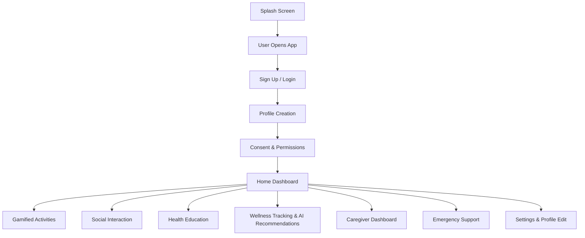

# 🧭 Thrive App Documentation

## 📘 App Overview

Thrive is a wellness mobile application specifically designed for elderly users (65+), focusing on enhancing their physical, mental, and social well-being through gamification, accessibility, and personalized support.

## 🔄 Application Flow



## 🎬 Core Features

### 0️⃣ Splash Screen
- **Purpose**: Branding, resource preloading, and authentication state verification
- **Features**:
  - Thrive logo animation
  - Firebase Auth state verification
  - Automatic routing to login or home dashboard
  - App language/local preferences loading

### 1️⃣ Authentication
- **Sign Up Options**:
  - Phone/email + password
  - Existing credentials login
  - Demo mode (limited access)
- **Security Features**:
  - Firebase Authentication
  - Optional 2FA (caregiver accounts)
  - Email/phone verification

### 2️⃣ Profile Creation
- **Required Information**:
  - Display name (username)
  - Age
  - Emergency contact
  - Preferred language
- **Optional Information**:
  - Gender
  - Home location
  - Email or alternate phone
- **Data Storage**: Secure Firestore database

### 3️⃣ Consent & Permissions
- **Required Consents**:
  - Terms of Use & Privacy Policy
  - Data handling policy (GDPR/PDPA compliant)
- **Optional Consents**:
  - Caregiver data sharing
  - Health data access (Google Fit/Apple HealthKit)
  - Location services

### 4️⃣ Home Dashboard
| Module | Icon | Description |
|--------|------|-------------|
| Gamified Activities | 🏃‍♂️ | Physical & cognitive games |
| Social Interaction | 💬 | Chat, groups, video |
| Health Education | 📖 | Wellness content |
| Wellness Tracking | 📊 | Logs, insights, AI suggestions |
| Caregiver Access | 👁️ | Activity monitoring, alerts |
| Emergency Support | 🆘 | SOS button, fall detection |
| Settings | 🔧 | Language, privacy, profile |

### 5️⃣ Gamified Activities
- **Types**:
  - Physical activities (step tracking, stretching)
  - Mental exercises (puzzles, memory games)
- **Features**:
  - Progress levels and rewards
  - Offline functionality
  - Performance logging

### 6️⃣ Social Interaction
- **Features**:
  - 1-on-1 & group chat
  - Group event calendar
  - Video calls (Twilio/Zoom SDK)
- **Security**:
  - End-to-end encryption
  - Block/report functionality
  - FCM notifications

### 7️⃣ Health Education
- **Content Types**:
  - Articles
  - Audio clips
  - Videos
- **Topics**:
  - Diabetes management
  - Heart health
  - Sleep hygiene
  - Medication management
- **Features**:
  - Progress tracking
  - Offline access
  - Bookmarking

### 8️⃣ Wellness Tracking & AI
- **Data Sources**:
  - Health platform integration
  - Usage analytics
  - Self-reported metrics
- **AI Features**:
  - Personalized recommendations
  - Activity tracking
  - Progress monitoring

### 9️⃣ Caregiver Dashboard
- **Access Control**:
  - Consent-based linking
  - 2FA requirement
- **Features**:
  - Health monitoring
  - Activity tracking
  - Emergency alerts
  - Analytics dashboard

### 🔟 Emergency Support
- **Features**:
  - One-tap SOS
  - Fall detection
  - Location sharing
  - Offline SMS fallback
- **Response Protocol**:
  - 5-second auto-response timer
  - Event logging
  - Emergency contact notification

## 🔧 Settings & Customization
- Language preferences
- Emergency contact management
- Privacy settings
- Help & support access
- Onboarding review

## 🌐 Offline Capabilities
- Gamified activities
- Health education content
- Emergency features
- Profile data caching
- Automatic synchronization

## 🔐 Security & Compliance
| Feature | Standard |
|---------|----------|
| Encryption | AES-256 + HTTPS |
| Authentication | Firebase Auth + 2FA |
| Data Storage | Firestore + Firebase Rules |
| Compliance | GDPR, PDPA, HIPAA-light |
| Backup | Daily (30-day retention) |

## 🌍 Language Support
| Language | Status |
|----------|--------|
| English | Default |
| Malay | Initial Release |
| Mandarin | Planned |
| Tamil | Planned |

## 📚 Documentation & Support
- Interactive onboarding
- Comprehensive FAQ
- Caregiver quick-start guide
- Voice-assisted navigation

## 💾 Database Schema

### Users Collection
```typescript
interface User {
  uid: string;                    // Firebase Auth UID
  displayName: string;            // User's display name
  email?: string;                 // Optional email
  phoneNumber?: string;           // Optional phone
  age: number;                    // User's age
  gender?: string;                // Optional gender
  preferredLanguage: string;      // Default: 'en'
  emergencyContacts: {            // Array of emergency contacts
    name: string;
    relationship: string;
    phoneNumber: string;
    isPrimary: boolean;
  }[];
  location?: {                    // Optional home location
    latitude: number;
    longitude: number;
    address: string;
  };
  createdAt: Timestamp;
  lastLogin: Timestamp;
  settings: {
    notifications: boolean;
    darkMode: boolean;
    fontSize: 'small' | 'medium' | 'large';
    voiceGuidance: boolean;
  };
}
```

### Activities Collection
```typescript
interface Activity {
  id: string;
  type: 'physical' | 'mental' | 'social';
  title: string;
  description: string;
  difficulty: 'easy' | 'medium' | 'hard';
  duration: number;              // in minutes
  points: number;                // reward points
  requirements: {
    minAge?: number;
    maxAge?: number;
    equipment?: string[];
  };
  content: {
    instructions: string;
    mediaUrl?: string;
    thumbnailUrl?: string;
  };
  createdAt: Timestamp;
  updatedAt: Timestamp;
}
```

### UserProgress Collection
```typescript
interface UserProgress {
  userId: string;
  activityId: string;
  status: 'not_started' | 'in_progress' | 'completed';
  startedAt?: Timestamp;
  completedAt?: Timestamp;
  score?: number;
  attempts: number;
  lastAttempt: Timestamp;
  achievements: {
    id: string;
    earnedAt: Timestamp;
  }[];
}
```

### SocialGroups Collection
```typescript
interface SocialGroup {
  id: string;
  name: string;
  description: string;
  type: 'chat' | 'video' | 'event';
  members: {
    userId: string;
    role: 'admin' | 'member';
    joinedAt: Timestamp;
  }[];
  createdAt: Timestamp;
  updatedAt: Timestamp;
  settings: {
    isPrivate: boolean;
    maxMembers?: number;
    allowedAgeRange?: {
      min: number;
      max: number;
    };
  };
}
```

### HealthData Collection
```typescript
interface HealthData {
  userId: string;
  date: Timestamp;
  metrics: {
    steps?: number;
    heartRate?: number;
    sleepHours?: number;
    mood?: 'very_happy' | 'happy' | 'neutral' | 'sad' | 'very_sad';
    energy?: 1 | 2 | 3 | 4 | 5;
  };
  notes?: string;
  source: 'manual' | 'healthkit' | 'googlefit';
}
```

### EmergencyEvents Collection
```typescript
interface EmergencyEvent {
  id: string;
  userId: string;
  type: 'sos' | 'fall_detection';
  status: 'active' | 'resolved' | 'false_alarm';
  location: {
    latitude: number;
    longitude: number;
    accuracy: number;
  };
  triggeredAt: Timestamp;
  resolvedAt?: Timestamp;
  responders: {
    contactId: string;
    notifiedAt: Timestamp;
    respondedAt?: Timestamp;
  }[];
  notes?: string;
}
```

## 📁 Project Structure

```
thriveapp/
├── android/                 # Android platform-specific code
├── ios/                    # iOS platform-specific code
├── lib/
│   ├── main.dart           # App entry point
│   ├── app.dart            # App configuration
│   ├── config/             # App configuration files
│   │   ├── routes.dart
│   │   ├── theme.dart
│   │   └── constants.dart
│   ├── core/               # Core functionality
│   │   ├── auth/
│   │   ├── database/
│   │   ├── storage/
│   │   └── analytics/
│   ├── features/           # Feature modules
│   │   ├── activities/
│   │   ├── social/
│   │   ├── health/
│   │   ├── emergency/
│   │   └── settings/
│   ├── models/             # Data models
│   ├── services/           # Business logic
│   ├── utils/              # Utility functions
│   └── widgets/            # Reusable widgets
├── assets/
│   ├── images/
│   ├── icons/
│   ├── fonts/
│   └── translations/       # i18n files
├── test/                   # Test files
│   ├── unit/
│   ├── widget/
│   └── integration/
├── docs/                   # Documentation
├── scripts/               # Build and deployment scripts
├── .github/              # GitHub workflows
├── pubspec.yaml          # Dependencies
└── README.md            # Project documentation
```

### Key Directories Explained

#### `lib/core/`
- **auth/**: Authentication and user management
- **database/**: Firestore and local database operations
- **storage/**: File storage operations
- **analytics/**: Usage tracking and analytics

#### `lib/features/`
- **activities/**: Gamified activities implementation
- **social/**: Social features and group management
- **health/**: Health tracking and monitoring
- **emergency/**: Emergency features and fall detection
- **settings/**: User settings and preferences

#### `lib/models/`
- Data models and type definitions
- Database schema interfaces
- API response models

#### `lib/services/`
- Business logic implementation
- API clients
- Third-party service integrations

#### `lib/widgets/`
- Reusable UI components
- Custom widgets
- Screen layouts

---

*For technical implementation details, please refer to the [Technical Documentation](./docs/TECHNICAL.md).*
